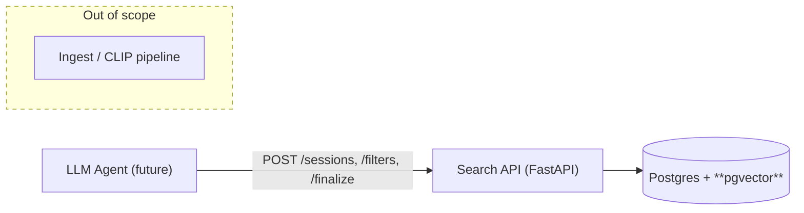
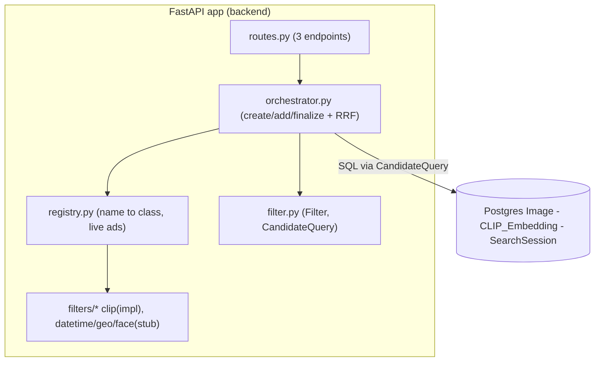
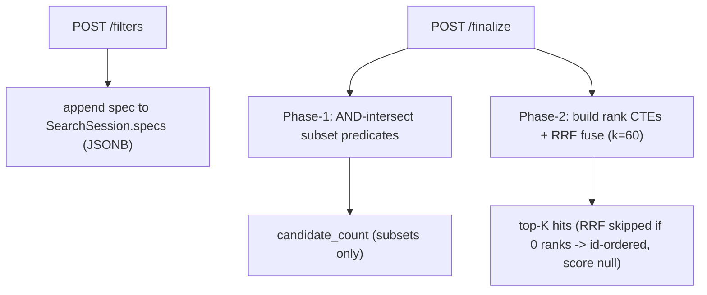

## Context

The backend ingests images and stores `CLIP_Embedding.embedding VECTOR(512)` with an **HNSW cosine index**, but there is no query path that lets an agent retrieve images by combining filters. This change adds the **Image Search** capability: a `Filter` abstraction, a `SearchSession` that accumulates filter calls, and an orchestrator that enforces a two-phase execution model (all subset filters first, then all rank filters fused by **Reciprocal Rank Fusion**). CLIP is implemented end-to-end; datetime/geo/face are registered stubs so the contract and tool surface exist without depending on not-yet-built ingestion (EXIF, PostGIS, face models). No agent/LLM code is written.

## Goals / Non-Goals

**Goals:**

- A `Filter` abstraction split by output shape: `SubsetFilter` (emits a `WHERE` predicate) and `RankFilter` (emits a rank CTE fused by RRF at **Finalize**).
- `ClipRank` implemented end-to-end over the existing **HNSW cosine index**.
- `DatetimeFilter`, `GeoFilter`, `FaceFilter` registered as stubs, rejected at add-time with `501`.
- `SearchSession` persistence: a Postgres row holding an ordered JSONB `specs` log, a `finalized` boolean, and `created_at`.
- API surface: `POST /sessions`, `POST /sessions/{id}/filters`, `POST /sessions/{id}/finalize`.
- Phase-1 (intersect all subset predicates) then phase-2 (build rank CTEs, RRF-fuse with `k=60`). RRF skipped entirely when zero rank filters.
- Lazy SQL push-down — the candidate set is a `Select`; no image IDs materialize into Python until `LIMIT K`.

**Non-Goals:**

- EXIF capture-time extraction, geo columns/PostGIS, face detection + embedding model + table.
- The LLM agent itself, auth, pagination, persisting result rows.
- Reopen/fork of a finalized session.

## C4 Diagrams

## Decisions

- **D1 — Subset vs Rank split.** `SubsetFilter.build_predicate() -> ColumnElement` produces a commutative `WHERE` clause; `RankFilter.build_rank_cte(candidates) -> Select` returns `(id, row_number)`. Rationale: membership narrowing (datetime/geo/face) is boolean while CLIP is continuous scoring, so a single score-and-threshold model would force awkward predicate-to-rank conversions. The split keeps each filter responsible for exactly one shape.

- **D2 — Lazy SQL push-down via `CandidateQuery`.** The universe is `select(Image.id)`; subset predicates are appended to `WHERE`; rank filters become CTEs fused at **Finalize**. Only the final `LIMIT K` returns IDs to Python. `candidate_count` is computed as `COUNT(*)` over the phase-1 `Select` built from the subset predicates only — rank specs are excluded from this count and apply last, so no image IDs materialize into Python until the final `LIMIT K`. Alternative considered: materialize the candidate ID set in Python after each filter. Rejected — it defeats index push-down, risks memory blow-up at scale, and makes RRF fusion a Python loop instead of a single SQL pass.

- **D3 — Phase is derived, not stored.** At **Finalize**, **Filter Spec**s are bucketed by `kind`: all subsets compose phase-1, all ranks compose phase-2. Tool call order is free. Alternative considered: a stored `phase` field on the session. Rejected — redundant state that can desync from the actual spec list.

- **D4 — RRF mechanics.** `score(id) = Σ weight / (k + rank_i(id))` with `k=60`, implemented as `union_all` of rank CTEs → `SUM(weight/(k+rank)) GROUP BY id → ORDER BY score DESC LIMIT top_k`. When there are zero rank filters, **Finalize** returns the narrowed set ordered by `Image.id` with `score: null` — no fabricated relevance score.

- **D5 — `ClipRank` vector laziness.** The text query is stored in the **Filter Spec**; the 512-dim vector is recomputed via `get_text_embeddings` at `from_spec` time. This keeps JSONB small and reproducible, and reuses the existing HNSW index through `CLIP_Embedding.embedding.cosine_distance(vec)`.

- **D6 — Stub fail-fast.** `build_predicate` raises `NotImplementedError` documenting the intended SQL (`EXIF between`, `ST_DWithin`/haversine, face threshold). The unified `/filters` endpoint rejects a stub at add-time with `501 Not Implemented`, and the registry advertises which filters are live so the agent never calls a dead one. `finalize` therefore never receives an un-executable spec.

- **D7 — Terminal session.** `finalized` flips to true at **Finalize**; a second `/filters` or second `/finalize` returns `409 Conflict`. Reopening/forking a finalized session is explicitly deferred.

- **D8 — Response field naming.** The filter-add response field is `candidate_count` (the running **Candidate Pool** size, subsets only), not the final output size. It is the `COUNT(*)` of the phase-1 subset query, independent of any rank filters. `number_of_images_in_output` is reserved for the **Finalize** response (the real **Top-K** size). `top_k` is unbounded; default `100`, decided by the calling agent.

## Risks / Trade-offs

- [R] `cosine_distance` may not use the HNSW index when fused inside rank CTEs. -> Mitigation: keep the CLIP filter as its own rank CTE over the indexed column and benchmark fusion cost; fall back to a subquery scan if the planner ignores the index.
- [R] JSONB spec drift / malformed `from_spec`. -> Mitigation: validate each spec through the registry on add; add round-trip registry tests.
- [R] `candidate_count` ignores rank filters by design (it is the phase-1 subset count). -> Mitigation: document explicitly in the API contract so the agent does not treat it as the final output size.
- [R] `get_text_embeddings` import cost. -> Mitigation: reuse the existing `core/clip.py` singleton rather than reloading the model.

## Migration Plan

- Add a `SearchSession` table via a new alembic migration: `id` PK, `specs JSONB`, `finalized bool`, `created_at timestamptz`.
- No backfill required. Rollback = drop the table.
- No new infrastructure: stack unchanged (Postgres 18 + **pgvector**, single sync engine). `api/v1/main.py` includes the new search router.

## Open Questions

- EXIF `capture_time` vs `uploaded_at` (pipeline change); geo as `lat/lon` + haversine vs PostGIS; face detection model + table; idempotent re-fetch of results (persist to a column?). These are deferred, not resolved, and would each warrant a later ADR if adopted.
